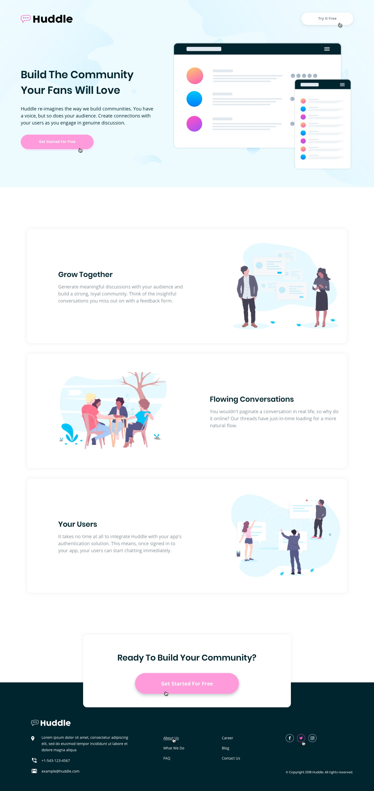

# responsiveness_media_queries-2

This project illustrates the concept of responsive webpages and the use of media queries in CSS, to view the webpage click [here]().

## Views

### Desktop Design

### Active States (Desktop)

### Mobile Design

View the CSS file from [here](./styles.css).
